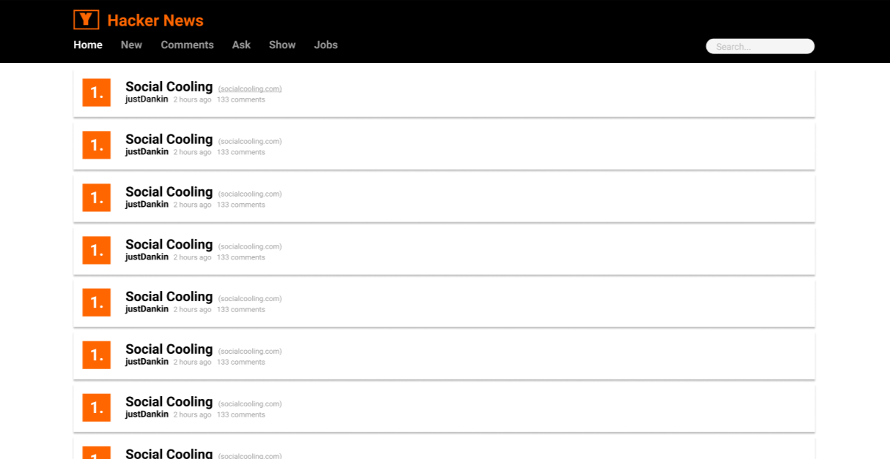

# Hacker News

## COMPONENTS

### Page1: Home
- [X] Header
    - [X] Menu
        * Home, New, Comments, Ask, Show, Jobs

- [X] Post Container
    - [ ] Post Items
        * Title, Url, Points, Author, Created, Link to comments detail

### Page2: Comments Detail
- [ ] Comments Container
    - [ ] Comments Items
        * Author, Created, Text

### Pagination
- [ ] Pagination 30 by limit

## REQUESTS

### Home
> https://hacker-news.firebaseio.com/v0/topstories.json?print=pretty

### New
> https://hacker-news.firebaseio.com/v0/newstories.json?print=pretty

### Comments
> https://hacker-news.firebaseio.com/v0/maxitem.json?print=pretty
> - Get the last item and then decrement to any limit you want

### Ask
> https://hacker-news.firebaseio.com/v0/askstories.json?print=pretty

### Show
> https://hacker-news.firebaseio.com/v0/showstories.json?print=pretty

### Jobs
> https://hacker-news.firebaseio.com/v0/jobstories.json?print=pretty

### Post item
> https://hacker-news.firebaseio.com/v0/item/:id.json?print=pretty

### Comment detail
> https://hacker-news.firebaseio.com/v0/item/:id.json?print=pretty

### Search
> https://hn.algolia.com/api/v1/search?query=:query&hitsPerPage=30